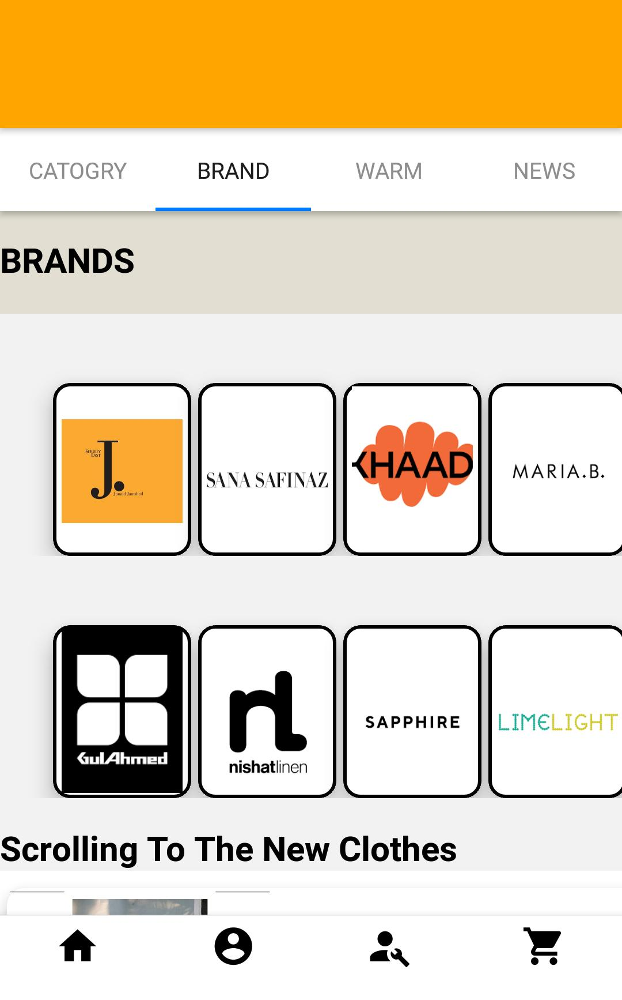

# **✨ AURA Boutique – Redefining Your Fashion Experience**

Welcome to **AURA Boutique**, your ultimate mobile shopping destination for the latest fashion trends and timeless classics. Designed with elegance and convenience in mind, AURA Boutique ensures a seamless shopping experience right at your fingertips. 

Whether you're searching for **chic casual wear, elegant formal outfits, or bold statement pieces**, we’ve got you covered. With intuitive navigation, a personalized wishlist, and exclusive offers, shopping for your dream wardrobe has never been easier!  

---

## **🚀 Features**

- 🌟 **Explore Stunning Collections** – Browse through a curated selection of trendy outfits with high-quality images and detailed descriptions.
- ❤️ **Save Your Favorites** – Add items to your wishlist and keep track of your must-have styles.
- 🛒 **Seamless Cart & Checkout** – Effortlessly add items to your cart and enjoy a smooth, hassle-free checkout experience.
- ➖ **Remove from Cart** – Easily manage your selections by removing unwanted items from your cart.
- 🔐 **Personalized User Experience** – Create an account and receive tailored fashion recommendations.
- 🚀 **Exclusive Offers & Flash Sales** – Get instant alerts about limited-time discounts and new arrivals.
- 🔔 **Push Notifications** – Stay ahead of the fashion game with real-time updates on trending styles.

---

## **🖼️ Screenshots**

### **Home Screen** – Browse a variety of outfits from top brands.  


### **Product Details** – Get all the details you need before making a purchase.  


### **Cart** – Manage your selected fashion pieces before checking out.  


---

## **🛠️ Built With**

- **React Native & Expo** – For a smooth and high-performance cross-platform experience.
- **Redux** – For efficient state management.
- **Firebase** – For authentication, real-time updates, and push notifications.
- **React Navigation** – For effortless screen transitions.
- **Vector Icons** – For a visually appealing and consistent design.

---

## **📲 Installation & Setup**

Follow these steps to set up and run the AURA Boutique app locally:

### **1. Clone the Repository**
```bash
 git clone https://github.com/your-username/AURA-Boutique-App.git
 cd AURA-Boutique-App
```

### **2. Install Dependencies**
```bash
npm install
```

### **3. Start the Application**
```bash
npx expo start
```

---

## **🤝 Contributing**

We welcome contributions from the community! To contribute:

1. **Fork** the repository.
2. **Create a new branch** (`feature/new-feature` or `fix/bug-name`).
3. **Commit your changes** with clear messages.
4. **Push to your branch** and submit a **Pull Request**.

---


## **📬 Contact**

For inquiries or feedback, feel free to reach out:

📧 **Email:**  uaimen337@gmail.com
💼 **LinkedIn:** [Um-e-Aimen](www.linkedin.com/in/um-e-aimen-823378245)  

---

✨ **Discover. Shop. Shine.** ✨
